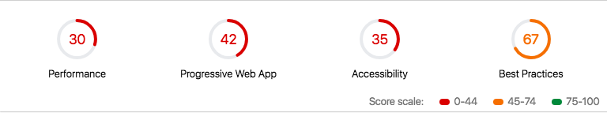

# Audits
* Lighthouse score
    * 
* [WebPagetest](https://www.webpagetest.org/result/181021_38_df6a0e4b7f55667a405b0c1329d05807/)

# My findings
* A number of blocking resources. (ionic.app.css, ionic.bundle.js)
* Minify all static assets. 
    * http://subwaytime.mta.info/lib/ionic/js/ionic.bundle.js
* Images don't have alt text.
* Images are not cached

# Action items
- [ ] What is Cordova used for?
- [ ] What is ionic used for?
- [ ] Use HTML/CSS for Subway Line images, or Sprite Sheets?