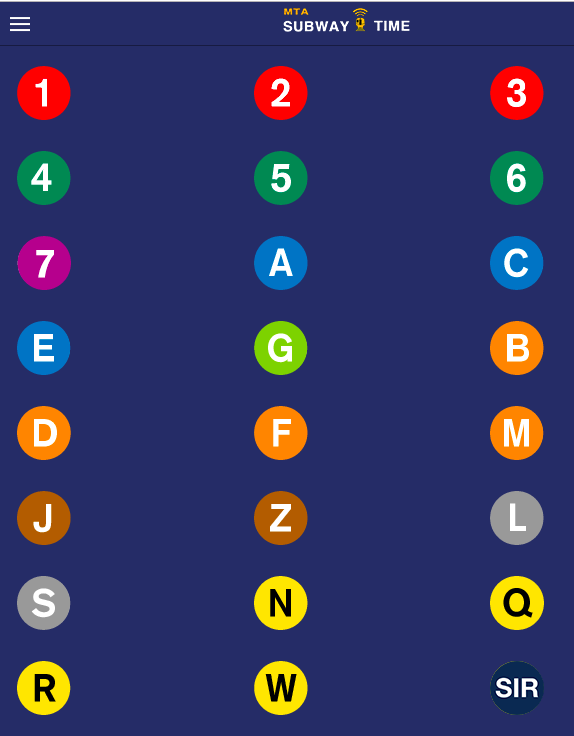
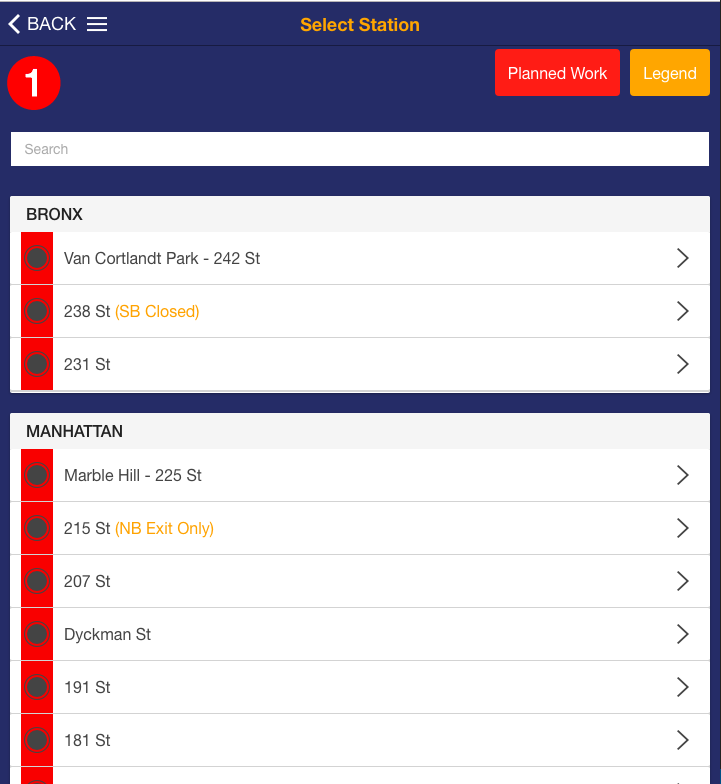
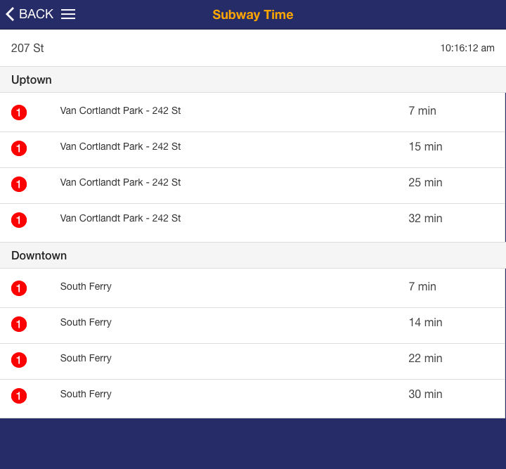
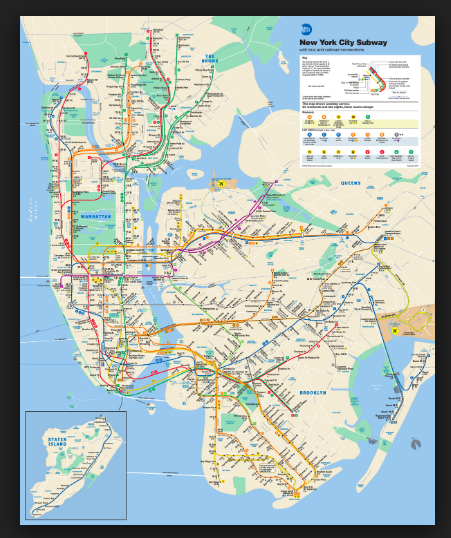

# Routing
* `/`
    * Show list of all subway lines
    * 
* `/train/:train-line`
    * Show list of all subway stations for `train-line`
    * 
* `/train/:train-line/:station`
    * Show list of subway times for `train-line` at `station`
    * 
* `/map/subway`
    * Show PDF of Subway Map
    * This should be available offline
    * 